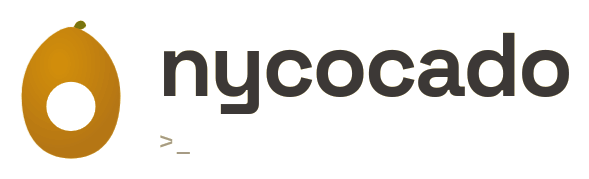

<div align="center">

# portfolio

<picture>
  <source media="(prefers-color-scheme: dark)" srcset="media/logo-dark.png">
  <source media="(prefers-color-scheme: light)" srcset="media/logo-light.png">
  
</picture>


[](LICENCE.md)

[](https://www.typescriptlang.org/)
[](https://nextjs.org/)
[](https://tailwindcss.com/)
[](https://vercel.com/)

[Portuguese](README.pt.md) | English

</div>

## About

Personal portfolio built with Next.js 16 (App Router) and TypeScript, focused on performance and a consistent visual identity. Single-page design using the Gruvbox colour palette and Manrope typography.

Available at **[nycocado.dev](https://nycocado.dev)**.

## How to run

```bash
npm install
npm run dev    # http://localhost:3000
npm run build
npm run lint
```

## License

Distributed under the **CC BY-NC 4.0** license, © 2025 Nycolas Souza.

Non-commercial use only. You may share and adapt the material as long as you give appropriate credit and do not use it for commercial purposes.

The full text is in [LICENCE.md](LICENCE.md).
